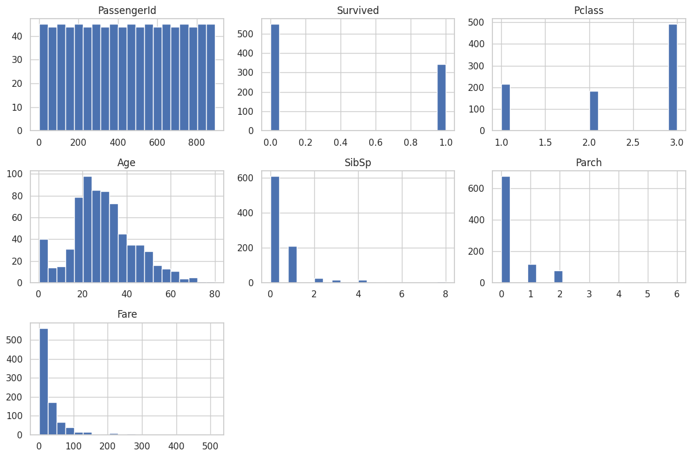

# titanic-eda-analysis
Exploratory Data Analysis (EDA) on the Titanic dataset using Python libraries like Pandas, Seaborn, Matplotlib, and Plotly to uncover patterns, visualize distributions, and understand feature relationships.

**Tools & Libraries Used:**
- Google Colab – Coding environment

- Pandas – Data manipulation

- NumPy – Numerical operations

- Matplotlib & Seaborn – Static visualizations

- Plotly Express – Interactive charts (optional)

**Dataset Details:**
- File Name: Titanic-Dataset (1).csv

- Description: Passenger information including age, gender, class, fare, and survival status.

**Workflow Summary:**
- Imported and loaded the dataset in Colab

- Inspected structure using .info(), .head(), .describe()

- Identified missing values

- Visualized distributions using histograms and boxplots

- Generated a correlation matrix to identify feature relationships

- Analyzed categorical variables (like Sex and Pclass) vs survival using countplots

- Created optional interactive plots using Plotly

**Key Insights:**
- Survival is closely related to gender and passenger class

- Detected outliers in Age and Fare columns

- Strong correlations can guide feature selection for ML

- Visualization makes hidden patterns easier to understand

**Output:**
- Cleaned, well-understood dataset

- Summary statistics

- Visualizations ready for modeling

**Visuals:**
### Correlation Heatmap

### Histogram

### Interactive Plotly Chart

### Numerical Boxplots

### Survived vs Categorical Barplots

